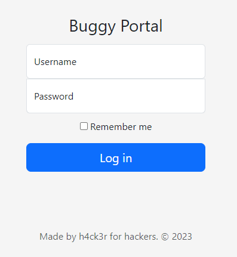

#Buggy Portal
##Challenge Description
Embark on a journey through the Buggy Portal to discover its concealed treasure. 
[Challenge Url](http://45.76.177.238:8087/)

##Starting the Investigation



First look at the website , we found a login page . So the challenge maybe done by SqlInjection. But it doesn't seems to be work. 
So have a look at the source code in JS part.

```javascript
function validateLogin() {
    var username = document.getElementById('username').value;
        var password = document.getElementById('password').value;

    function checkName(name)
            {
                var check = name.split("").reverse().join("");
                return check === "ypjnimdarepus" ? !0: !1;
            }

    function checkLenght(pwd) {
            return (pwd.length % 4 == 0) ? !0: !1;
            }

    function obfuscatePassword(password) {
            var obfuscatedPassword = ""; 
            
            for (var i = 0; i < password.length; i++) {
                var obfuscatedChar = String.fromCharCode(password.charCodeAt(i) + 1);
                    obfuscatedPassword += obfuscatedChar;
                }
                return obfuscatedPassword;
            }

    function validatePassword(password) {
            return valid = (obfuscatePassword(password) === "tvqfsbenjoqx" ) ? !0 : !1;
            }

            if (!checkName(username)) {
                alert('Incorrect Name!');
            }

            if (!checkLenght(password) && !(validatePassword(password)) ) {
                alert('Incorrect Password');
            }

            var xhr = new XMLHttpRequest();
            xhr.open('POST', 'auth.php', true);
            xhr.setRequestHeader('Content-Type', 'application/x-www-form-urlencoded');
            
            xhr.onreadystatechange = function () {
                if (xhr.readyState === XMLHttpRequest.DONE) {
                    if (xhr.status === 200) {
                        var response = JSON.parse(xhr.responseText)
                        document.getElementById('message').textContent = response.message;
                        window.location.href = 'flagggsxyhzb.php';                                       
                      } else {
                        console.error('Error:', xhr.status);
                    }
                }
            };

            var data = 'username=' + encodeURIComponent(username) + '&password=' + encodeURIComponent(password);
            xhr.send(data);
        }
```
By analyzind the code we dound that the username is the reverse of **"ypjnimdarepus"**. So username is : **superadminjpy**
For password, it matches a text when it get obfuscated it's equal to the string **tvqfsbenjoqx**. So we need to deobfuscate the text.
Generate a python code to deobfuscate the text,you may done it by ChatGPT

```python
def deobfuscate_password(obfuscated_password):
    original_password = ""
    for char in obfuscated_password:
        original_char = chr(ord(char) - 1)
        original_password += original_char
    return original_password

obfuscated_password = "tvqfsbenjoqx"  # Replace with the obfuscated password
original_password = deobfuscate_password(obfuscated_password)
print("Deobfuscated Password:", original_password)
```
Output: ```Deobfuscated Password: superadminpw```

Now login, and go through this paage **"/flagggsxyhzb.php"** listed on JS code above. 
Hoorray , found the flag.
##Flag
The flag for this challenge was: 

```ruby
CTF_BD{cl13nt_5id3_c0d3_r3v13w_15_h1dd3n_tr34sur3}
```
