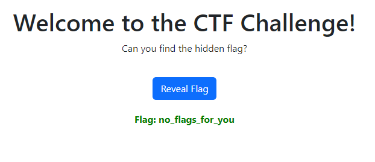

# WarmUpGame

##Challenge Description
My first website consistently greets me with an 'Access Denied' message whenever I attempt to access it. The mystery remains unsolved.

[Challenge URL](http://45.76.177.238:8097/)

##Starting the Investigation

Every time we open the site, we are faced with the same page.



Let's delve into the source code to see if we can find any clues. In **"/js/main.js,"** we found the first part of the flag:

```javascript
document.addEventListener("DOMContentLoaded", function () {
    const revealFlagButton = document.getElementById("revealFlagButton");
    const flagText = document.getElementById("flagText");

    revealFlagButton.addEventListener("click", function () {
        const flag = 'CTF_BD{Congratulations!_';
        flagText.textContent = "Flag: no_flags_for_you";
        flagText.style display = "block";

        console.log(`Flag: ${flag}`);
    });
}
```
In css/main.css, we discovered the second part as a comment: **You've_Successfully_**
```css
body {
    background-color: #f0f0f0;
}

.container {
    text-align: center;
    margin-top: 50px;
}

#revealFlagButton {
    margin-top: 20px;
}

#flagText {
    font-weight: bold;
    color: green;
    margin-top: 20px;
}
/* You've_Successfully_*/
```

However, we haven't found the last part yet. Let's take a look at **robots.txt**
```ruby
User-agent: ^_^
Disallow: /secrets/

User-agent: *
Allow: /
```
Found something interesting **/secrect/** folder.
But the folder seems to be protected, and it shows **403 forbidden.** Install [403-Bypass](https://github.com/channyein1337/403-bypass) Tools. and run as   
```ruby
python3 403-bypass.py -u http://45.76.177.238:8097 -p secrets
```
It gives the link to bypass 403. 
```
http://45.76.177.238:8097/secrets..;/
```
By following this link, we obtained the last part of the flag: **Unlocked_the_Hidden_Path}**

##Flag
```
CTF_BD{Congratulations!_You've_Successfully_Unlocked_the_Hidden_Path}
```